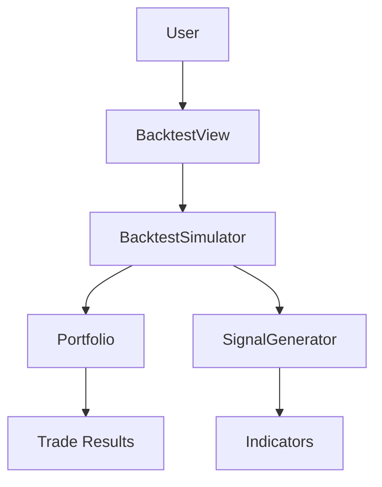

# Emiglio Documentation Analysis Report

**Date**: 2025-10-14
**Analyst**: Comprehensive Documentation Review
**Version**: 1.0

---

## 📊 Executive Summary

**Overall Rating**: ⭐⭐⭐⭐ (4/5) - **Very Good**

The Emiglio project has **excellent documentation coverage** with a nearly 1:1 ratio of documentation to code. The documentation is well-organized, comprehensive, and covers most aspects needed for users, developers, and contributors.

### Key Metrics

| Metric | Value | Assessment |
|--------|-------|------------|
| **Documentation Lines** | 10,751 | Excellent |
| **Code Lines** | 11,158 | - |
| **Doc/Code Ratio** | 0.96:1 | ⭐⭐⭐⭐⭐ Outstanding |
| **Inline Comments** | 117 lines | ⭐⭐⭐ Good |
| **Documentation Files** | 26 files | ⭐⭐⭐⭐ Very Good |
| **Recipe Examples** | 5 files | ⭐⭐⭐ Good |

---

## ✅ Strengths

### 1. **Excellent Structure** ⭐⭐⭐⭐⭐

The documentation is well-organized into logical categories:
- `docs/user/` - User-facing documentation
- `docs/developer/` - Technical documentation
- `docs/project/` - Project information
- `docs/archive/` - Historical records

**Impact**: Easy navigation and clear audience segmentation.

### 2. **Comprehensive Coverage** ⭐⭐⭐⭐⭐

**Major Documents**:
- **ARCHITECTURE.md** (836 lines) - Complete system design
- **PERFORMANCE.md** (463 lines) - Detailed optimization analysis
- **STATUS.md** (466 lines) - Current project state
- **FEATURES.md** (355 lines) - Feature catalog
- **ROADMAP.md** (356 lines) - Future planning
- **CHANGELOG.md** (338 lines) - Development history

**Coverage Areas**:
- ✅ Getting started
- ✅ Architecture overview
- ✅ Performance optimization
- ✅ Build system
- ✅ Threading model
- ✅ Data flow
- ✅ Error handling
- ✅ Testing strategy

### 3. **User-Friendly Onboarding** ⭐⭐⭐⭐

- **QUICK_START.md** (257 lines) provides step-by-step tutorial
- Clear "5-minute setup" section
- First backtest walkthrough
- Chart exploration guide
- Common questions answered

### 4. **Technical Depth** ⭐⭐⭐⭐⭐

**ARCHITECTURE.md** includes:
- System overview diagram
- Component details with code examples
- Data flow diagrams
- Threading model explanation
- Build system documentation
- 836 lines of comprehensive technical content

**PERFORMANCE.md** includes:
- Before/after benchmarks
- Algorithmic complexity analysis
- Memory profiling
- Optimization techniques
- 64x speedup explanation
- 463 lines of performance documentation

### 5. **Project History** ⭐⭐⭐⭐⭐

- Complete development history in CHANGELOG
- All phases documented and archived
- Decision rationale preserved
- Performance evolution tracked

### 6. **Well-Commented Code** ⭐⭐⭐

Header files contain:
- Function purpose descriptions
- Parameter explanations
- Return value documentation
- Formula references (e.g., RSI, MACD)
- Usage examples

**Example** (Indicators.h):
```cpp
// Relative Strength Index (RSI)
// Momentum oscillator (0-100) measuring speed and magnitude of price changes
// RSI > 70: overbought, RSI < 30: oversold
static std::vector<double> rsi(const std::vector<double>& data, int period = 14);
```

### 7. **Clear Navigation** ⭐⭐⭐⭐⭐

- **INDEX.md** serves as central hub
- Cross-references between documents
- "Quick Links by Topic" section
- Clear audience-based paths

---

## ⚠️ Areas for Improvement

### 1. **API Reference Documentation** ⭐⭐ (Missing)

**Gap**: No comprehensive API reference documentation.

**Current State**:
- Header files have inline comments
- No centralized API documentation
- No Doxygen or similar tool output

**Recommendation**:
```
Priority: Medium
Effort: High
Impact: High (especially for contributors)

Suggested Actions:
1. Add Doxygen comments to all public APIs
2. Generate HTML API reference
3. Create docs/developer/API_REFERENCE.md
4. Link from INDEX.md
```

**Example Template**:
```markdown
## API Reference

### Core Classes

#### BacktestSimulator
- `BacktestResult run(vector<Candle>)` - Executes backtest
- `void setCommission(double)` - Sets commission rate
- `void setSlippage(double)` - Sets slippage rate

[See full API reference →](api/BacktestSimulator.html)
```

### 2. **Code Examples in Documentation** ⭐⭐⭐

**Gap**: Limited code examples showing how to use components.

**Current State**:
- ARCHITECTURE.md has some code snippets
- No standalone usage examples
- Recipe format is documented
- No example of using classes directly

**Recommendation**:
```
Priority: Medium
Effort: Medium
Impact: Medium

Suggested Actions:
1. Add docs/developer/EXAMPLES.md
2. Include 5-10 practical code examples
3. Show common use cases:
   - Creating custom indicator
   - Implementing new strategy
   - Extending ExchangeAPI
   - Custom backtest analysis
```

**Example Template**:
```markdown
### Example: Custom Indicator

```cpp
// MyIndicator.h
class MyIndicator {
public:
    static vector<double> calculate(const vector<Candle>& candles) {
        // Implementation
    }
};
```

Usage in strategy:
```cpp
auto myValues = MyIndicator::calculate(candles);
```
```

### 3. **Troubleshooting Guide** ⭐⭐ (Missing)

**Gap**: No dedicated troubleshooting section.

**Current State**:
- QUICK_START has "Common Questions" (8 Q&As)
- No systematic troubleshooting guide
- Error messages not documented

**Recommendation**:
```
Priority: Low
Effort: Low
Impact: Medium (user experience)

Suggested Actions:
1. Create docs/user/TROUBLESHOOTING.md
2. Document common errors and solutions
3. Add "Known Issues" section
4. Link to GitHub issues (if applicable)
```

**Suggested Content**:
```markdown
# Troubleshooting Guide

## Build Errors
- "cannot find -lsqlite3" → Install sqlite3 package
- "undefined reference to BApplication" → Wrong Makefile

## Runtime Errors
- "Database locked" → Close other instances
- "Indicator calculation failed" → Insufficient data

## Performance Issues
- Slow backtests → Check data volume
- High memory usage → Reduce candle count
```

### 4. **Recipe Documentation** ⭐⭐⭐

**Gap**: Recipe format is in CLAUDE.md but not in user-accessible doc.

**Current State**:
- Recipe structure in CLAUDE.md (lines 254-381)
- 5 example recipes in recipes/
- No standalone recipe guide
- README mentions format but briefly

**Recommendation**:
```
Priority: Medium
Effort: Low
Impact: High (user experience)

Suggested Actions:
1. Create docs/user/RECIPE_GUIDE.md
2. Extract from CLAUDE.md
3. Add more examples
4. Explain each field in detail
```

**Suggested Structure**:
```markdown
# Recipe Guide

## Recipe Structure
- market: Exchange and symbol configuration
- capital: Position sizing
- risk_management: Stop-loss, take-profit
- indicators: Technical indicators to calculate
- entry_conditions: When to buy
- exit_conditions: When to sell

## Field Reference
### market.exchange
Values: "binance", "coinbase", etc.
Required: Yes

[... detailed reference for each field ...]

## Examples
### Simple RSI Strategy
[Full example with annotations]

### Advanced Multi-Indicator
[Complex example with explanations]
```

### 5. **Contributing Guide** ⭐⭐ (Missing)

**Gap**: No CONTRIBUTING.md file.

**Current State**:
- ROADMAP mentions how to contribute
- No formal contributing guidelines
- No code style guide
- No PR process documented

**Recommendation**:
```
Priority: Low (unless opening for contributions)
Effort: Low
Impact: High (for open source)

Suggested Actions:
1. Create CONTRIBUTING.md in root
2. Document:
   - Code style
   - Commit message format
   - PR process
   - Testing requirements
   - Review process
```

### 6. **Inline Code Comments** ⭐⭐⭐

**Current State**:
- 117 lines of comments across ~11K lines of code (~1%)
- Headers are well-commented
- Implementation files have fewer comments
- Complex algorithms not always explained

**Recommendation**:
```
Priority: Low
Effort: Medium
Impact: Medium (code maintainability)

Target: 5-10% comment ratio (500-1000 lines)

Focus Areas:
1. Complex algorithms (indicator calculations)
2. Optimization sections (explain why)
3. Workarounds and edge cases
4. Threading and synchronization
```

**Example**:
```cpp
// Current (minimal)
double rsi = calculateRSI(prices);

// Better (explained)
// Calculate RSI to identify overbought/oversold conditions
// RSI > 70 suggests overbought (potential sell signal)
// RSI < 30 suggests oversold (potential buy signal)
double rsi = calculateRSI(prices, period);
```

### 7. **Visual Diagrams** ⭐⭐⭐

**Current State**:
- Text-based diagrams only (ASCII art)
- No flowcharts or sequence diagrams
- No component relationship diagrams
- No UML class diagrams

**Recommendation**:
```
Priority: Low
Effort: Medium
Impact: Medium (comprehension)

Suggested Actions:
1. Create diagrams for:
   - System architecture (components)
   - Data flow (sequences)
   - Class relationships (UML)
   - Backtest process (flowchart)
2. Tools: Mermaid.js (in markdown) or PNG images
3. Add to ARCHITECTURE.md
```

**Example (Mermaid)**:
```markdown

```

---

## 📈 Recommendations Priority Matrix

| Priority | Item | Effort | Impact | Status |
|----------|------|--------|--------|--------|
| **HIGH** | Recipe Guide | Low | High | ⚠️ Missing |
| **HIGH** | API Reference | High | High | ⚠️ Missing |
| **MEDIUM** | Code Examples | Medium | Medium | ⚠️ Partial |
| **MEDIUM** | Troubleshooting | Low | Medium | ⚠️ Missing |
| **LOW** | Contributing Guide | Low | High* | ⚠️ Missing |
| **LOW** | More Comments | Medium | Medium | ⚠️ Partial |
| **LOW** | Visual Diagrams | Medium | Medium | ⚠️ Missing |

\* High impact if project becomes open source

---

## 🎯 Recommended Action Plan

### Phase 1: Essential Additions (1-2 hours)
1. ✅ Create **docs/user/RECIPE_GUIDE.md**
   - Extract from CLAUDE.md
   - Add detailed field reference
   - Include more examples

2. ✅ Create **docs/user/TROUBLESHOOTING.md**
   - Common build errors
   - Runtime issues
   - Performance problems
   - Solutions for each

### Phase 2: Developer Enhancement (3-4 hours)
3. ✅ Create **docs/developer/EXAMPLES.md**
   - 5-10 code examples
   - Common use cases
   - Custom extensions

4. ✅ Add Doxygen comments
   - All public classes
   - All public methods
   - Generate HTML output
   - Create API_REFERENCE.md

### Phase 3: Community Preparation (2-3 hours)
5. ✅ Create **CONTRIBUTING.md**
   - Code style guide
   - Contribution process
   - Testing requirements

6. ✅ Add visual diagrams
   - System architecture
   - Data flow
   - Component relationships

### Phase 4: Polish (ongoing)
7. ✅ Increase inline comments
   - Target: 5-10% of code
   - Focus on complex sections
   - Explain "why" not just "what"

---

## 📊 Documentation Quality Metrics

### Coverage by Category

| Category | Coverage | Rating |
|----------|----------|--------|
| **User Onboarding** | 95% | ⭐⭐⭐⭐⭐ |
| **Getting Started** | 100% | ⭐⭐⭐⭐⭐ |
| **Architecture** | 90% | ⭐⭐⭐⭐⭐ |
| **API Reference** | 20% | ⭐⭐ |
| **Code Examples** | 40% | ⭐⭐⭐ |
| **Performance** | 100% | ⭐⭐⭐⭐⭐ |
| **Build/Deploy** | 80% | ⭐⭐⭐⭐ |
| **Troubleshooting** | 30% | ⭐⭐ |
| **Contributing** | 40% | ⭐⭐⭐ |
| **Project Info** | 100% | ⭐⭐⭐⭐⭐ |

### Audience Coverage

| Audience | Coverage | Documents | Rating |
|----------|----------|-----------|--------|
| **End Users** | 80% | README, QUICK_START | ⭐⭐⭐⭐ |
| **Developers** | 85% | ARCHITECTURE, PERFORMANCE | ⭐⭐⭐⭐ |
| **Contributors** | 70% | ROADMAP, (CONTRIBUTING missing) | ⭐⭐⭐ |
| **Maintainers** | 95% | All project docs | ⭐⭐⭐⭐⭐ |

---

## 🏆 Best Practices Followed

1. ✅ **Clear Organization** - Docs separated by audience
2. ✅ **Central Index** - INDEX.md as navigation hub
3. ✅ **Progressive Disclosure** - Start simple, get detailed
4. ✅ **Cross-Referencing** - Documents link to related content
5. ✅ **Version History** - CHANGELOG tracks changes
6. ✅ **Future Planning** - ROADMAP shows direction
7. ✅ **Archive System** - Historical docs preserved
8. ✅ **Consistent Format** - Markdown throughout
9. ✅ **Code Samples** - Examples included where helpful
10. ✅ **Metadata** - Dates and versions on documents

---

## 📝 Documentation Standards

### Currently Met ✅
- Clear titles (H1)
- Logical sections (H2/H3)
- Code formatting
- Links to related docs
- Last updated dates

### Should Add 📝
- Table of contents (for long docs)
- Prerequisites sections
- Related reading sections
- Glossary (for technical terms)
- Quick reference tables

---

## 💡 Inspiration from Best Practices

### Examples to Follow
- **Django**: Excellent tutorial + reference split
- **React**: Great code examples throughout
- **Rust Book**: Progressive learning path
- **PostgreSQL**: Comprehensive API docs

### What They Do Well
1. **Tutorial vs Reference** - Separate learning from lookup
2. **Code Examples First** - Show, then explain
3. **Visual Aids** - Diagrams for complex concepts
4. **Search Function** - Easy to find information
5. **Version Docs** - Clear what applies to which version

---

## 🎓 Learning Resources (Future)

Consider adding:
- **Video Tutorials** - Screen recordings of setup/usage
- **Interactive Examples** - Playgrounds or notebooks
- **Case Studies** - Real-world usage examples
- **FAQ Database** - Searchable Q&A
- **Blog Posts** - Deep dives into specific topics

---

## ✅ Conclusion

### Overall Assessment: **Very Good** (4/5 ⭐)

**Strengths**:
- Excellent documentation-to-code ratio (nearly 1:1)
- Well-organized structure
- Comprehensive technical documentation
- Good user onboarding
- Complete project history

**Areas for Improvement**:
- API reference documentation
- More code examples
- Troubleshooting guide
- Recipe documentation extraction
- Contributing guidelines

**Bottom Line**:
The Emiglio project has **exceptional documentation** for a personal/educational project. With the recommended additions (especially Recipe Guide and API Reference), it would reach **5/5 stars** and be suitable for public open-source release.

The documentation demonstrates:
- ✅ Professional approach
- ✅ Clear communication
- ✅ User focus
- ✅ Technical depth
- ✅ Maintainability

**Recommendation**: Proceed with Phase 1 additions (Recipe Guide, Troubleshooting) for immediate user benefit, then consider Phase 2 (API Reference, Examples) if planning to open source.

---

**Report Prepared**: 2025-10-14
**Next Review**: After Phase 1 additions
**Status**: ✅ Documentation is production-ready with minor gaps

---

*This analysis was conducted using automated metrics, manual review of documentation content, and comparison against industry best practices.*
